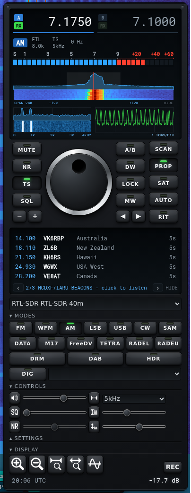
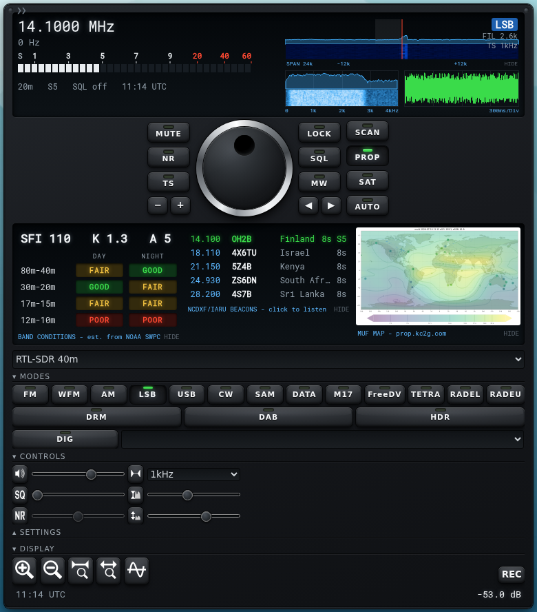
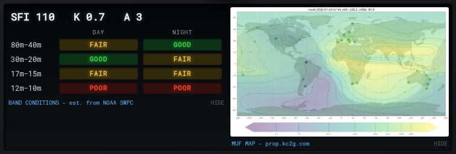
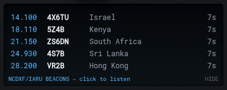
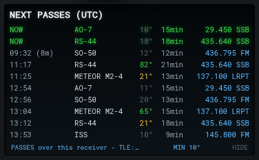
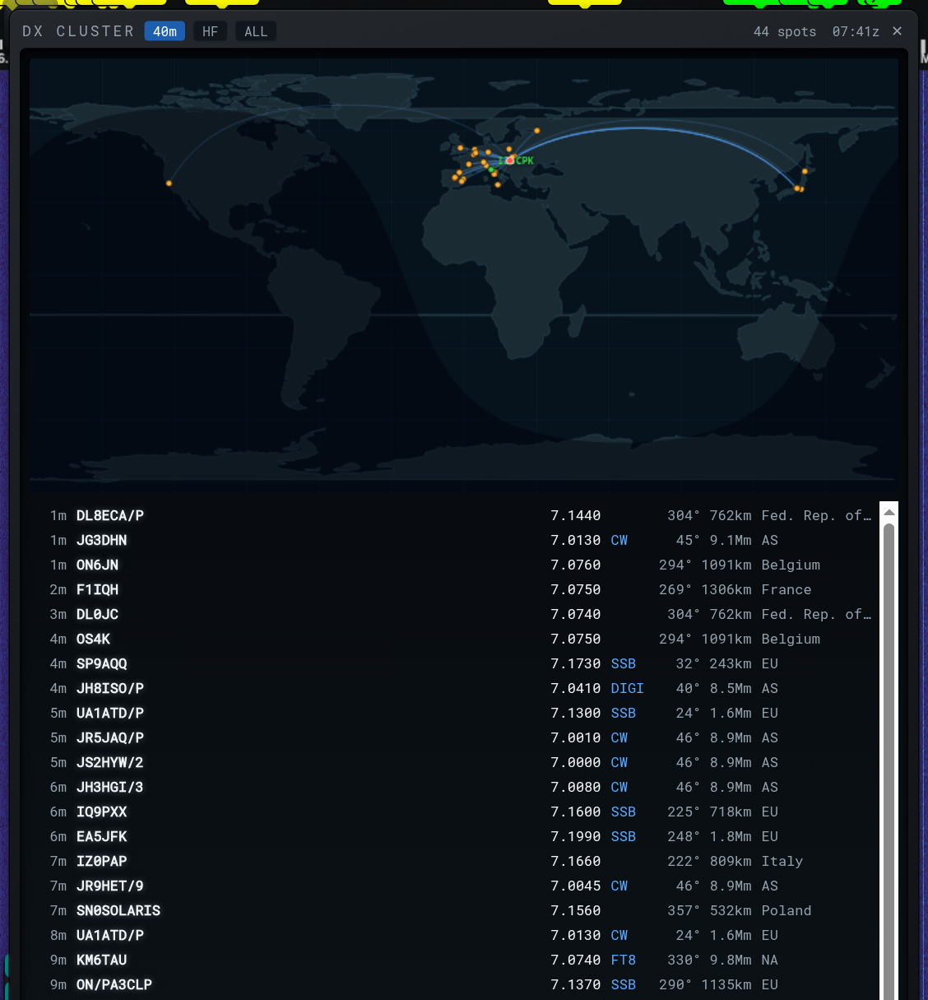

# OpenWebRX+ Rig Skin Plugin

This plugin makes the OpenWebRX+ receiver panel look and work like a real
rig: dark front panel, a VFO dial you can actually turn, an LCD with proper
readouts, meters and scopes. I wrote it for my own receiver (SDRplay on a
magnetic loop) because I never got used to tuning with sliders, and it
grew from there.

It is a plain receiver plugin. No fork, nothing patched. It adds a "Rig"
entry to the normal theme dropdown, so you and your visitors can switch
between this and the stock look any time.



## The dial and the keys

The dial tunes. Drag it, flick it and it keeps spinning, or use the mouse
wheel: one notch is exactly one tuning step, whatever your mouse. Works
with a finger on phones and tablets.

Around the dial there are three key columns, every key with a status LED:

- MUTE, NR and TS on the left. TS opens the tuning step picker and has an
  Auto entry that follows the mode (100 Hz on SSB/CW, 5 or 9 kHz on AM,
  12.5 kHz on FM and so on).
- LOCK, SQL and MW in the middle. LOCK freezes the dial, which has saved
  me more than once on a wall mounted tablet. SQL switches the squelch on
  with an automatically chosen level. MW writes a bookmark where you are.
- SCAN, PROP, SAT and AUTO on the right. SCAN runs the bookmark scanner
  that the stock UI hides behind a right click. AUTO snaps the VFO onto
  the strongest signal nearby, handy when you are roughly on a station
  and want to land exactly on it.

Below the keys sit small - / + and left / right pairs: waterfall zoom and
paging, so you never have to pinch the waterfall on a phone. Paging walks
the zoomed view through the capture window, and at the edge it moves the
receiver window itself if the server allows center frequency changes.

## The LCD

White frequency digits, the mode on a blue badge, and FIL / TS readouts so
you always know the filter width and what one dial click does. The S-meter
is segmented with peak hold. Under it, two scopes:

- A band scope centered on the tuned frequency, like the center mode scope
  on a rig. Click it to tune, scroll it to step, SPAN switches the width
  and grows automatically on wide FM. It shares the palette and levels of
  the main waterfall and averages its trace, so weak signals are easy to
  spot and click.
- An audio scope: spectrum of what you are hearing with a small waterfall,
  and a scrolling waveform. Good for tuning SSB by eye. Click the S-meter
  to show or hide it.

On large screens a chevron in the top left corner widens the rig into a
two column face, readouts left, scopes right, and the LCD gains a line
with the current band, S units, squelch state, mute flag and UTC clock.



## Propagation

The PROP key opens a second LCD with three views. Use the prev/next
arrows in the caption bar to move between them (the page counter shows
where you are); the wide layout shows them side by side:

- Band conditions estimated from NOAA SWPC data (solar flux and K index),
  drawn as day/night pills per band group.
- The NCDXF/IARU beacon tracker. The 18 beacons transmit in a fixed,
  UTC synchronized rotation on 14.100, 18.110, 21.150, 24.930 and 28.200,
  so the rig knows which beacon is on the air on each frequency at any
  second. Click a frequency to listen in CW; while you sit on it the row
  turns green and shows your live S reading. Three minutes on 14.100
  tells you more about the state of 20 m than any prediction.
- The live MUF world map from prop.kc2g.com.





## Satellites

The SAT key opens the pass list: predicted passes over the receiver's own
location for a handful of satellites worth listening to (ISS, SO-50,
AO-91, RS-44, AO-7 with its 10 m downlink you can hear on an HF antenna,
Meteor M2-3 and M2-4 for weather images). Each row shows the time and a
countdown, duration, max elevation color coded by how good the pass is,
and the downlink. A pass in progress glows green with NOW. The MIN control
hides passes too low to be useful. Click the frequency and the receiver
jumps there with the right mode, across bands if the server allows it.

Orbits come from a public TLE API, cached for half a day, and the pass
math runs in your browser.



## DX cluster

The DX button in the top banner opens a window with live spots from the
DX cluster network, on a world map and in a list. The map shows every
spot as a pin, the great circle path from your QTH to the station, and
the day/night line, so you see at a glance which paths are open right
now. The list gives the age of the spot, callsign, frequency, mode, and
the bearing and distance from your receiver, handy with a directional
antenna. Click a spot or a pin and the receiver jumps there with the
right mode set.

The map is interactive: scroll to zoom toward the cursor, drag to pan,
double-click to reset, pinch to zoom on a phone. Hover a spot to read
its callsign, bearing and distance. Zooming in is the easy way to pick
apart spots that pile up near home.

Filter chips at the top switch between the band you are tuned to, all
of HF, or everything. The ACT chip switches to a band-activity chart:
spots per band from 160 m up through VHF, the band you are on
highlighted, with a trend line so you can see which bands are waking up.
Click a band in the chart to jump there. The window can be dragged
anywhere and resized by its corner grip, and it remembers its size,
position and filter.

Spots stream in live from the HolyCluster network, with DXSummit as the
backlog source where the page can reach it. The map itself is drawn in
your browser from public domain Natural Earth coastline data, no map
service involved.



## Waterfall

There is a "Rig" palette in the waterfall theme selector, a jet style ramp
with a steep low end that keeps weak signals visible. The band scope picks
it up automatically. Works best together with auto adjusting waterfall
levels on the server.

## Install

### Download the zip (simplest)

Grab the latest `openwebrxplus-rig-skin-x.y.z.zip` from the
[releases page](https://github.com/aganet/openwebrxplus-rig-skin/releases),
unzip the `rig_skin/` folder into your plugins tree, and load it by name.
From the folder that holds your `docker-compose.yml` (swap in the current
version number):

```sh
V=0.8.2
curl -L -o rig-skin.zip \
  "https://github.com/aganet/openwebrxplus-rig-skin/releases/download/v${V}/openwebrxplus-rig-skin-${V}.zip"
unzip -o rig-skin.zip 'rig_skin/*' -d plugins/receiver/
rm rig-skin.zip
grep -q "Plugins.load('rig_skin')" plugins/receiver/init.js 2>/dev/null \
  || echo "Plugins.load('rig_skin');" >> plugins/receiver/init.js
```

On a Debian package install the plugins folder is
`/usr/lib/python3/dist-packages/htdocs/plugins/receiver/`; unzip there
instead. The zip carries three files (`rig_skin.js`, `rig_skin.css`,
`rig_skin_map.js`); keep them together.

### Update to a newer version

Same as above: download the newer zip and unzip it over the existing
folder. `unzip -o` overwrites the old files. Then hard-refresh the browser
(Ctrl+Shift+R). No container restart needed when the folder is
bind-mounted.

### Remote (no files on the server)

One line in your `plugins/receiver/init.js`, always serves the latest:

```js
Plugins.load('https://aganet.github.io/openwebrxplus-rig-skin/receiver/rig_skin/rig_skin.js');
```

### From the repo

If you prefer git, from the folder that holds your `docker-compose.yml`:

```sh
cd /path/to/your/compose/folder
git clone https://github.com/aganet/openwebrxplus-rig-skin.git
mkdir -p plugins/receiver
cp -r openwebrxplus-rig-skin/receiver/rig_skin plugins/receiver/
echo "Plugins.load('rig_skin');" >> plugins/receiver/init.js
rm -rf openwebrxplus-rig-skin
```

### Docker mounting

However you got the files there, you end up with this layout next to
your `docker-compose.yml`:

```text
docker-compose.yml
plugins/
  receiver/
    init.js
    rig_skin/
      rig_skin.js
      rig_skin.css
      rig_skin_map.js
```

Mount it into the openwebrx service in `docker-compose.yml`. Relative
paths work in compose. Two options:

Option A, mount the whole plugins folder. Simple, and the layout the
official docs use. It hides the plugins bundled inside the image (`utils`,
the examples) and anything previously copied into the container, so use it
when this folder is your only source of plugins:

```yaml
services:
  openwebrx:
    volumes:
      - ./plugins:/usr/lib/python3/dist-packages/htdocs/plugins
```

Option B, mount only the rig_skin folder plus init.js. Nothing else in the
container is touched, so plugins that already exist inside the image or
container keep working:

```yaml
services:
  openwebrx:
    volumes:
      - ./plugins/receiver/rig_skin:/usr/lib/python3/dist-packages/htdocs/plugins/receiver/rig_skin:ro
      - ./plugins/receiver/init.js:/usr/lib/python3/dist-packages/htdocs/plugins/receiver/init.js
```

If your installation already has its own `init.js` loading other plugins,
do not mount a new one over it: drop the second line and add
`Plugins.load('rig_skin');` to the existing file instead.

Step 3: recreate the container and refresh the browser:

```sh
docker compose up -d
```

Then pick "Rig" in the theme dropdown (Settings section of the receiver
panel). Hard-refresh once (Ctrl+Shift+R) if it does not show up.

With plain `docker run` the same mounts work as `-v "$PWD/plugins:..."`
arguments.

Tip: if an edit to `plugins/receiver/init.js` does not show up, restart the
container. Some editors replace the file on save, which breaks a
single-file bind mount until a restart.

## Check the version

Each release bumps a version number inside the plugin. To see which one
is actually running, open the receiver, press F12 for the browser
console and type:

```js
Plugins.rig_skin._version
```

It is a plain number, so 0.8.2 reads as `0.82`. If it shows an older
number than you installed, the browser is serving a cached copy;
hard-refresh with Ctrl+Shift+R.

To check what the server hands out, independent of the browser cache:

```sh
curl -s https://YOUR-RECEIVER/plugins/receiver/rig_skin/rig_skin.js | grep _version
```

or, on the server itself, `grep _version plugins/receiver/rig_skin/rig_skin.js`.

## Credits

A skin for OpenWebRX:

- [OpenWebRX+](https://github.com/luarvique/openwebrx), the fork it is
  built for, maintained by luarvique and 0xAF.
- [OpenWebRX](https://github.com/jketterl/openwebrx) by Jakob Ketterl,
  the original it is based on.

Data and libraries the plugin uses:

- Orbit propagation: [satellite.js](https://github.com/shashwatak/satellite-js) (MIT), loaded on demand
- Solar data: NOAA SWPC (public domain)
- MUF map: [prop.kc2g.com](https://prop.kc2g.com/)
- TLE data: [tle.ivanstanojevic.me](https://tle.ivanstanojevic.me/)
- DX spots: [HolyCluster](https://holycluster.iarc.org/) by IARC and [DXSummit](http://www.dxsummit.fi/)
- Coastlines: [Natural Earth](https://www.naturalearthdata.com/) (public domain), bundled
