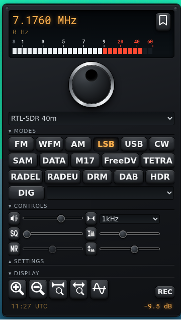

# OpenWebRX+ Rig Skin Plugin

A receiver plugin for [OpenWebRX+](https://fms.komkon.org/OWRX/) that adds a
"Rig" theme: a dark transceiver front panel with a working VFO dial and a
segmented S-meter.



## Features

- Dark front-panel theme, selectable from the standard theme dropdown
  (Settings section of the receiver panel). Switching themes turns the whole
  skin on and off, no reload needed.
- VFO dial with chrome bezel and finger cup. Drag around its center to tune
  (one tuning step per 15 degrees), scroll for single steps, or flick it and
  it keeps spinning with flywheel inertia.
- Segmented horizontal S-meter drawn inside the frequency LCD, with S1..S9
  plus red 20/40/60 dB scale, meter ballistics (fast attack, slow decay) and
  a peak-hold segment.
- Amber backlit LCD frequency display, domed keys with backlit active state,
  recessed sliders with metal thumbs.
- The receiver panel widens to 330 px while the theme is active; the dial
  shrinks automatically on short screens.

## Install

### Remote (no files on the server)

Add this line to your `plugins/receiver/init.js`:

```js
Plugins.load('https://aganet.github.io/openwebrxplus-rig-skin/receiver/rig_skin/rig_skin.js');
```

### Local

Copy `receiver/rig_skin/` into the OpenWebRX+ plugins folder and load it by
name:

```sh
cp -r receiver/rig_skin /path/to/htdocs/plugins/receiver/
echo "Plugins.load('rig_skin');" >> /path/to/htdocs/plugins/receiver/init.js
```

On a Debian package install the plugins folder is
`/usr/lib/python3/dist-packages/htdocs/plugins/receiver/`.

### Docker

Keep the plugins next to your `docker-compose.yml` and bind-mount them into
the container.

1. Go to the folder that holds your `docker-compose.yml` and create the
   plugins tree with the plugin in it:

```sh
cd /path/to/your/compose/folder
git clone https://github.com/aganet/openwebrxplus-rig-skin.git
mkdir -p plugins/receiver
cp -r openwebrxplus-rig-skin/receiver/rig_skin plugins/receiver/
echo "Plugins.load('rig_skin');" >> plugins/receiver/init.js
rm -rf openwebrxplus-rig-skin
```

You end up with this layout:

```
docker-compose.yml
plugins/
  receiver/
    init.js
    rig_skin/
      rig_skin.js
      rig_skin.css
```

2. Add the volume to the openwebrx service in `docker-compose.yml`
   (relative paths work in compose):

```yaml
services:
  openwebrx:
    volumes:
      - ./plugins:/usr/lib/python3/dist-packages/htdocs/plugins
```

3. Recreate the container and refresh the browser:

```sh
docker compose up -d
```

Then select "Rig" in the theme dropdown (Settings section of the receiver
panel) and hard-refresh the browser once (Ctrl+Shift+R) if the theme does
not show up.

If you use `docker run` instead of compose, the same mount is
`-v "$PWD/plugins:/usr/lib/python3/dist-packages/htdocs/plugins"`.

Note: if you already have a `plugins/receiver/init.js` loading other
plugins, only add the `Plugins.load('rig_skin');` line to it.

## License

MIT, see [LICENSE](LICENSE).
